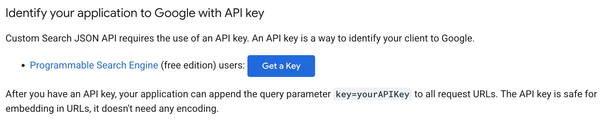
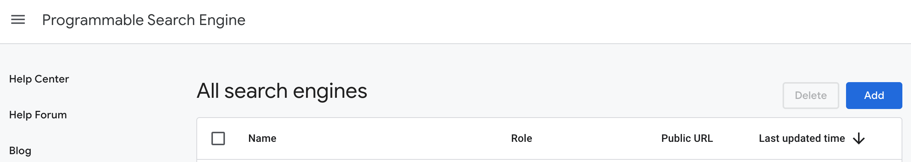
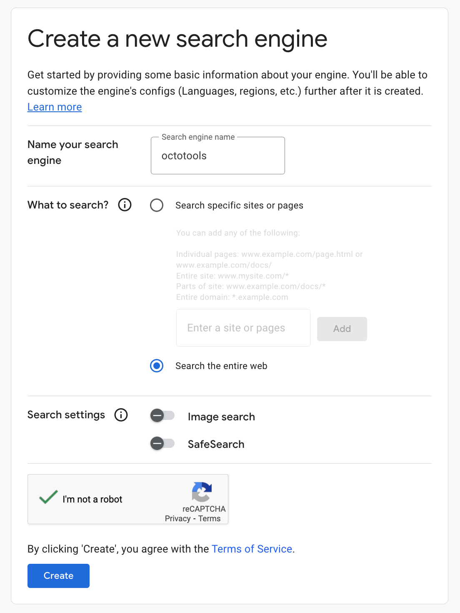

# Google Search Tool

The Google Search Tool enables AI agents to perform web searches using Google's Custom Search API. This tool allows you to search the web for real-time information and retrieve structured search results.

## Features

- **Web Search**: Perform Google searches with custom queries
- **Configurable Results**: Control the number of search results returned
- **Structured Output**: Returns organized data with titles, links, and snippets
- **Error Handling**: Comprehensive error handling for API issues
- **Environment-based Configuration**: Secure API key management

## Prerequisites

Before using the Google Search Tool, you need to set up:

1. **Google API Key** - For accessing the Custom Search API
2. **Google Custom Search Engine (CX)** - For defining search scope

## Setup Instructions

### Step 1: Get Google API Key

1. Visit the [Google Custom Search API documentation](https://developers.google.com/custom-search/v1/introduction)
2. Go to the [Google Cloud Console](https://console.cloud.google.com/)
3. Create a new project or select an existing one
4. Enable the "Custom Search JSON API"
5. Create credentials (API Key)
6. Copy your API key



### Step 2: Create Custom Search Engine

1. Visit [Google Programmable Search Engine](https://programmablesearchengine.google.com)
2. Click "Add" to create a new search engine



3. Configure your search engine:
   - **Sites to search**: Enter `*` to search the entire web
   - **Name**: Give your search engine a descriptive name
   - **Language**: Select your preferred language



4. Click "Create" to generate your search engine


5. Copy the **Search Engine ID (CX)** from the control panel

### Step 3: Configure Environment Variables

Set up your environment variables:

```bash
export GOOGLE_API_KEY=your_api_key_here
export GOOGLE_CX=your_cx_here
```

Or create a `.env` file in your project root:

```env
GOOGLE_API_KEY=your_api_key_here
GOOGLE_CX=your_cx_here
```

## Usage

### Basic Usage

```python
from octotools.tools.google_search.tool import Google_Search_Tool

# Initialize the tool
tool = Google_Search_Tool()

# Perform a search
results = tool.execute(query="Python programming tutorials", num_results=5)

# Display results
for i, result in enumerate(results, 1):
    print(f"{i}. {result['title']}")
    print(f"   URL: {result['link']}")
    print(f"   {result['snippet']}\n")
```

### Advanced Usage

```python
# Search with custom parameters
results = tool.execute(
    query="machine learning best practices 2024",
    num_results=10
)

# Handle errors
if "error" in results[0]:
    print(f"Search failed: {results[0]['error']}")
else:
    print(f"Found {len(results)} results")
```

## API Reference

### Google_Search_Tool Class

#### Constructor
```python
Google_Search_Tool()
```
Initializes the Google Search Tool with default configuration.

#### Methods

##### `execute(query: str, num_results: int = 10) -> List[Dict[str, Any]]`

Performs a Google search and returns structured results.

**Parameters:**
- `query` (str): The search query string
- `num_results` (int): Number of results to return (default: 10, max: 10)

**Returns:**
- `List[Dict[str, Any]]`: List of search result dictionaries

**Result Format:**
```python
[
    {
        "title": "Result Title",
        "link": "https://example.com",
        "snippet": "Brief description of the result..."
    },
    # ... more results
]
```

**Error Format:**
```python
[
    {
        "error": "Error message describing what went wrong"
    }
]
```

## Examples

### Example 1: Basic Search
```python
tool = Google_Search_Tool()
results = tool.execute(query="nobel prize winners 2024")
```

### Example 2: Limited Results
```python
results = tool.execute(query="Python tutorials", num_results=3)
```

### Example 3: Error Handling
```python
results = tool.execute(query="test query")

if "error" in results[0]:
    print(f"Error: {results[0]['error']}")
    # Handle the error appropriately
else:
    # Process successful results
    for result in results:
        print(result['title'])
```

## Testing

To test the tool:

```bash
# Set environment variables
export GOOGLE_API_KEY=your_api_key_here
export GOOGLE_CX=your_cx_here

# Run the test
cd octotools/tools/google_search
python tool.py
```

## Troubleshooting

### Common Issues

1. **"Google API key is not set"**
   - Ensure `GOOGLE_API_KEY` environment variable is set
   - Verify the API key is valid and has Custom Search API enabled

2. **"No results found"**
   - Check if your search query is valid
   - Verify your Custom Search Engine (CX) is configured correctly
   - Ensure the search engine is set to search the entire web (`*`)

3. **API Quota Exceeded**
   - Google Custom Search API has daily quotas
   - Check your usage in the Google Cloud Console
   - Consider upgrading your API plan if needed

4. **Invalid CX Error**
   - Verify your `GOOGLE_CX` environment variable is correct
   - Ensure the Custom Search Engine is active

### Rate Limits

- **Free Tier**: 100 searches per day
- **Paid Tier**: Up to 10,000 searches per day
- **Per Query Limit**: Maximum 10 results per request

## Security Notes

- Never commit API keys to version control
- Use environment variables or secure key management
- Regularly rotate your API keys
- Monitor API usage to prevent unexpected charges

## Support

For issues related to:
- **Google Custom Search API**: [Google API Documentation](https://developers.google.com/custom-search/v1/introduction)
- **Custom Search Engine**: [Google CSE Documentation](https://cse.google.com/)
- **OctoTools Integration**: Check the main OctoTools documentation
